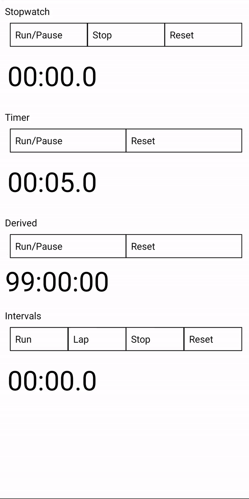

# react-native-yet-another-stopwatch-timer
   

## Features
A fully extensible stopwatch, timer component for React Native.
* Uses [react-native-reanimated](https://www.npmjs.com/package/react-native-reanimated) and [react-native-worklets](https://www.npmjs.com/package/react-native-worklets) to make performant component updates
* Allows for custom timing functions, precision, group / digit rendering, states and transitions

<p align="center">
  
</p>

## Installation
```
npm install --save react-native-yet-another-stopwatch-timer
```
This library uses [react-native-reanimated](https://www.npmjs.com/package/react-native-reanimated) and [react-native-worklets](https://www.npmjs.com/package/react-native-worklets) listed as peer dependencies so you have to provide them:
```
npm install --save react-native-reanimated react-native-worklets
```
Minimal supported versions of peer dependencies are defined by [react-native-reanimated compatibility table](https://docs.swmansion.com/react-native-reanimated/docs/guides/compatibility/) and [react-native-worklets compatibility table](https://docs.swmansion.com/react-native-worklets/docs/guides/compatibility/).

## Usage
Check out [example project](./example) for most of use cases:

| File | Example description |
| :----  | :----------- |
| [Stopwatch](./example/Stopwatch.jsx) | controlling the stopwatch, providing style for digits, callback after every transition |
| [Timer](./example/Timer.jsx) | controlling the timer, setting initial value for countdown, providing style for digits, callback after every transition |
| [Derived](./example/Derived.jsx) | controlling the timer, setting initial value for countdown, providing style for digits, custom render function |
| [Intervals](./example/Intervals.jsx) | controlling the stopwatch, providing style for digits, using counter value in handler, using callback after transition success, using Static renderer for other component to preserve same style |

Or check minimal examples to copy-paste:

### Minimal Stopwatch example
```jsx
import React, { useRef, useCallback } from 'react';
import { View, TouchableOpacity, Text } from 'react-native';
import { Stopwatch, StopwatchTransitions, StopwatchStates } from 'react-native-yet-another-stopwatch-timer';

const Component = () => {
  const timerRef = useRef(null);
  // use timerRef to call transitionTo property to switch states
  const run = useCallback(() => timerRef.current?.transitionTo({ name: StopwatchTransitions.Run }), [ timerRef ]);
  // use onBeforeTransition, onAfterTransition callback to access counter on state change
  const pause = useCallback(() => timerRef.current?.transitionTo({ name: StopwatchTransitions.Pause, onAfterTransition: console.log }), [ timerRef ]);
  return (
    <View>
      <TouchableOpacity onPress={run}><Text>Run</Text></TouchableOpacity>
      <TouchableOpacity onPress={pause}><Text>Pause</Text></TouchableOpacity>
      <Stopwatch timerRef={timerRef} />
    </View>
  );
};
```

### Minimal Timer usage example
```jsx
import React, { useState, useRef, useCallback } from 'react';
import { View, TouchableOpacity, Text } from 'react-native';
import { Timer, TimerTransitions, TimerStates } from 'react-native-yet-another-stopwatch-timer';

const Component = ({ initialCounterValue }) => {
  const [ laps, setLaps ] = useState(0);
  const timerRef = useRef(null);
  // use timerRef to call transitionTo property to switch states, set transition name to one of StopwatchTransitions, counterValue if you want to change it outside of timingHandler
  const run = useCallback(() => timerRef.current?.transitionTo({ name: TimerTransitions.Run, counterValue: initialCounterValue }), [ timerRef, initialCounterValue ]);
  const onAfterTransition = useCallback(({ state }) => {
    if (state.value === TimerStates.Stopped) setLaps((prevLaps) => prevLaps + 1);
  }, [ setLaps ]);
  return (
    <View>
      <TouchableOpacity onPress={run}><Text>Run</Text></TouchableOpacity>
      <Timer timerRef={timerRef} onAfterTransition={onAfterTransition} initialCounterValue={initialCounterValue} />
      <Text>Laps: {laps}</Text>
    </View>
  );
};
```

## Q&A

### How to show less or more places? How to render differently, use other digit changing animations?
Provide your own render property and declare needed reanimated derived values for counter, that gets updated by timingHandler each timingInterval by timingInterval, by default counter gets incremented by 100 every 100 ms. Check example [Derived](./example/Derived.jsx).

### How to get better timing precision?
`setTimeout` and `setInterval` guarantee that callback will be called *not sooner* than `timeout` ms. For precise timing you can either implement a self adjusting timer, that compensates for varying timeout call times, or use `Date.now()`, or if you just need to accurately capture when run, pause or stop events occur, capture precise time in global onBeforeTransition/onAfterTransition handlers, or for individual transitions in transitionHandler.

## Getting started with customisation
The module exports [Counter](./src/Counter.jsx), [Stopwatch](./src/Stopwatch.jsx) and [Timer](./src/Timer.jsx) components, state and transition names.

Counter serves as base component that only provides means of calling transition function and registers timing handler.

Stopwatch is implemented by providing default values for Counter:
  - `initialState` for the state machine
  - `timingHandler` to increment the counter at least every timingInterval by timingInterval
  - `removeTiming` to clean the timeout when the component is removed
  - `transitionHandler` that returns an object with `nextState` property based on transition and current state
  - `render` function that returns a React component provided counter and style arguments

Timer features are achieved by providing other timing function to Stopwatch that decrements the counter and issues a transition to stopped state when it reaches zero.

## Development
In order to develop the application or build android .apk from the sources one should:
1. Clone this repository
2. Navigate to parent directory and install dev dependencies with `npm ci` for linting `npm run lint` and typescript typechecking `npm run typecheck`.
3. Navigate to example folder: `cd example`
4. Install example project dependencies `npm ci`, since library has only peer dependencies
5. Run Metro bundler with `npm run start`
6. Connect physical device or an emulator via adb, like this (tested with [mEMU](https://www.memuplay.com/)):
	- `adb connect 127.0.0.1:21503`
	- `adb reverse tcp:8081 tcp:8081`
7. Build and watch with `npm run-android`, changes from src directory are picked automatically because of example metro and babel configurations.

**Note:** example project is configured in [a way](./example/metro.config.js), that may cause issues if you save anything as a regular dependency in parent library

## Contributions
PR are always welcome!
